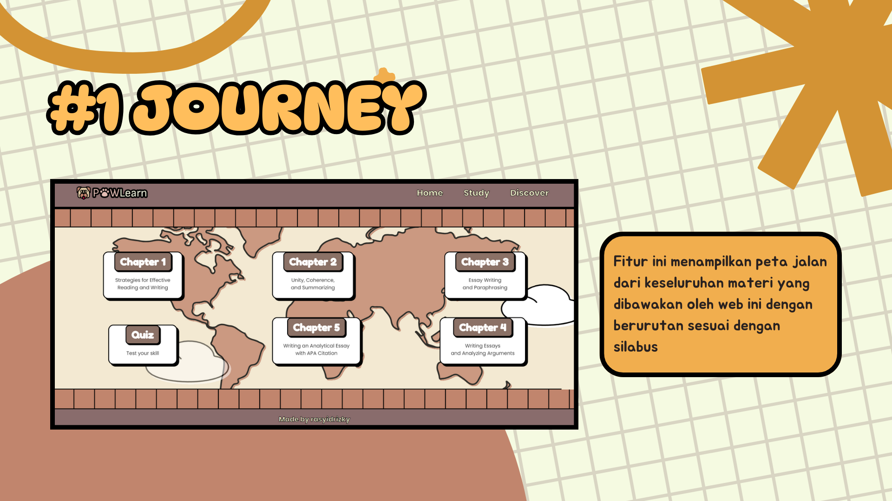
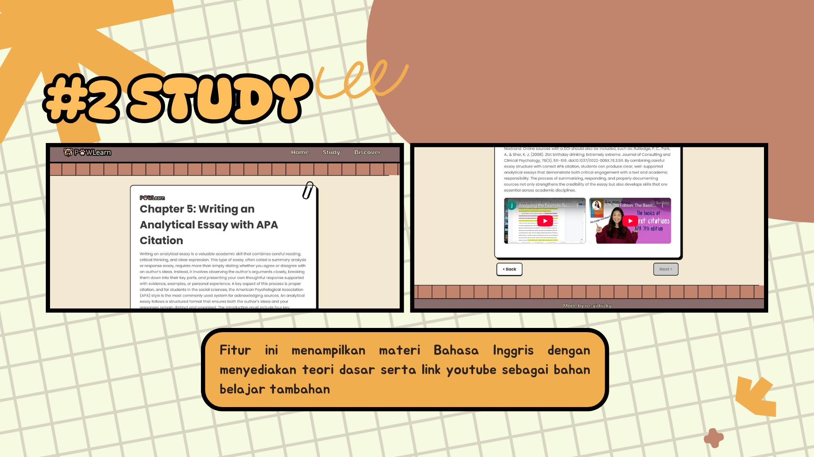
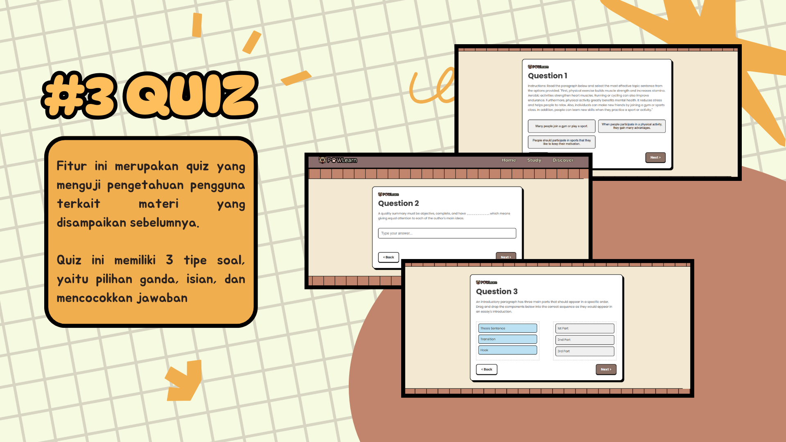
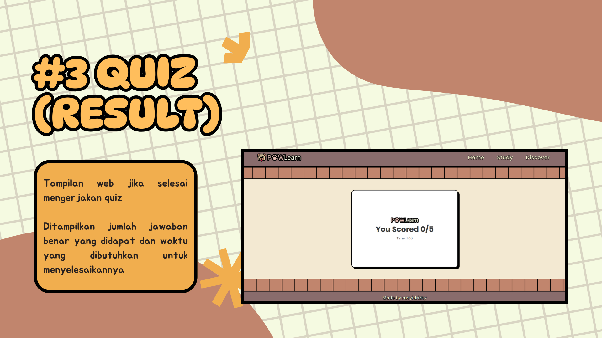
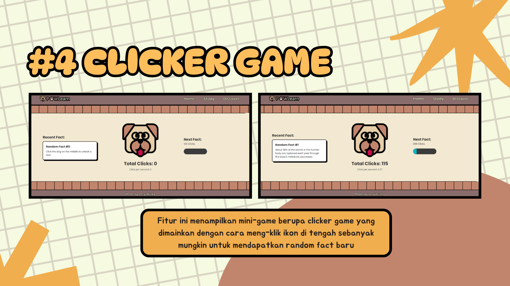

# PAWLearn

## Author
Rasyid Rizky Susilo Nurdwiputro

## PAWLearn

PAWLearn is a web-based virtual lab using HTML, CSS, and JavaScript for topics in college-level courses, particularly academic writing and critical analysis in English. This website presents specialized material covering reading comprehension through strategies such as SQ3R and the development of writing skills in the form of paragraph and essay writing.

## Tech Stack
Vanilla:
- HTML
- CSS
- Javascript

## Features
**Journey**
 

**Study**
 

**Quiz**
 

**Clicker Game**
 
