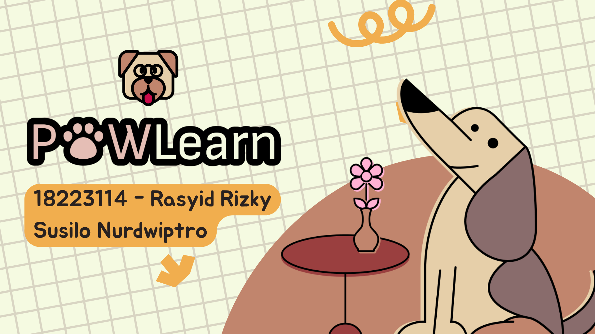
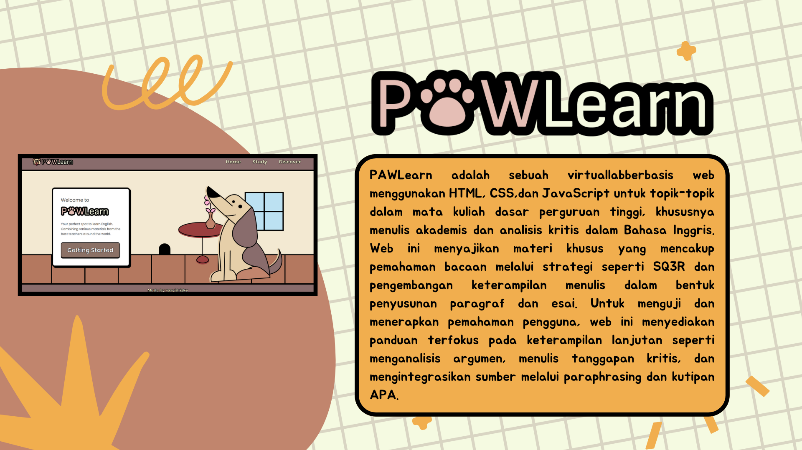

# PAWLearn - An English Virtual Lab

    

        
        
        
    

   

     >> <a href="https://paw-learn.vercel.app" target="_blank"><b>PAWLearn Live Website</b></a> <<
    

## Author
| Nama |
| ------------- |
| Rasyid Rizky Susilo Nurdwiputro |

## PAWLearn
PAWLearn is a web-based virtual lab using HTML, CSS, and JavaScript for topics in college-level courses, particularly academic writing and critical analysis in English. This website presents specialized material covering reading comprehension through strategies such as SQ3R, the development of writing skills in the form of paragraph and essay writing, theory of speaking, and much more.

## Setup
**How to use**
1. `git clone https://github.com/rasyidrizky/PAWLearn.git`
2. If you're using Node.js use: `npx serve`
3. Open `http://localhost:3000`

## Tech Stack
**Main Foundation & Backend**
- Language: JavaScript (Node.js)

**Data Management & Database**
- Database: Firestore Database

**Authentication & Security**
- Authentication: Firebase Authentication

**Frontend**
- User Interface: Vanilla HTML
- Styling: Vanilla CSS
- Interactivity: Vanilla JavaScript

**Platform & Deployment Services**
- Application Platform: Vercel
- Database Platform: Firebase

## Features
**Login/Register**
 

**Journey**
 

**Study**
 

**Quiz**
 

**Clicker Game**
 

**Profile**
 
